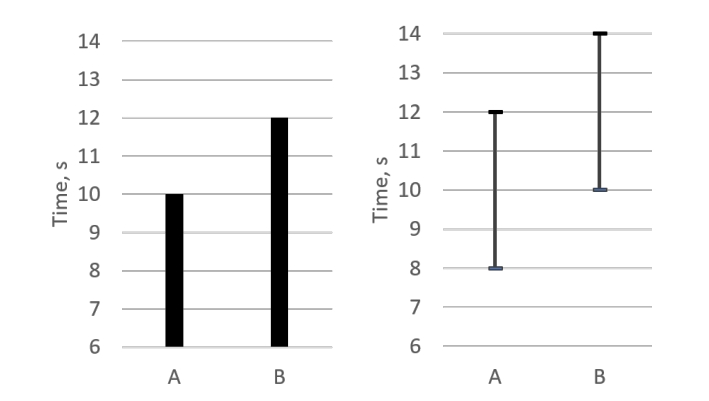

## 图6：两个直方图展示了平均值可能会误导的情况
在现代计算机上，每个版本的程序运行时间少于10分钟。这意味着仅仅生成三个样本就需要1小时的时间：每个程序版本各30分钟。想象一下，您的测试套件中不仅仅有一个基准测试，而是有数百个。即使将工作分布到多台计算机上，收集足够统计数据可能会变得非常昂贵。

您如何知道需要多少样本才能达到足够的统计分布？
这个问题的答案再次取决于您希望比较具有多高的精确度。样本分布中样本之间方差越小，所需的样本数就越少。标准差[^40]是一个指标，用来衡量分布中测量值的一致性。可以通过根据标准差动态限制基准测试迭代次数的方式来实施自适应策略，也就是说，您收集样本直到标准差落在某个范围[^41]内为止。一旦标准差低于某个阈值，您可以停止收集测量数据。这个策略在[Akinshin，2019年，第4章]中有更详细的解释。

另一个需要注意的重要事项是异常值的存在。使用置信区间可以将一些样本（例如，冷启动）视为异常值进行排除，但不要故意从测量数据集中删除不需要的样本。对于某些类型的基准测试，异常值可能是最重要的指标之一。例如，在对具有实时约束的软件进行基准测试时，99百分位数可能非常有意义。Gil Tene在YouTube上有一系列关于测量延迟的演讲，涵盖了这个主题。
## 2.5 软件和硬件计时器
为了对执行时间进行基准测试，工程师通常使用两种不同的计时器，现代平台都提供了这两种计时器：
- 系统范围的高分辨率计时器。这是一个系统计时器，通常实现为从某个任意的起始日期,称为纪元[^42]开始，计算自那以来经过的时钟周期数。此时钟是单调的，即它总是向上增长的。
[^40] 标准差40 - https://en.wikipedia.org/wiki/Standard_deviation
[^41] 这种方法要求测量次数必须大于1。否则，算法会在第一个样本后停止，因为基准测试的单次运行标准差为零。
[^42] Unix纪元始于1970年1月1日00:00:00 UT：https://en.wikipedia.org/wiki/Unix_epoch。
