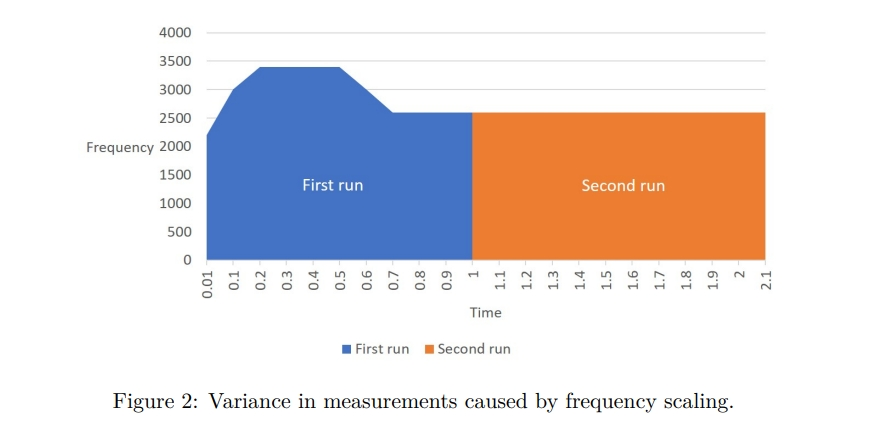

# 2.1 现代系统中的噪音

硬件和软件中有许多旨在提高性能的特性。但并非所有特性都具有确定性行为。让我们考虑一下动态频率调节[^22]（Dynamic Frequency Scaling，DFS）：这是一种允许CPU在短时间内增加频率，使其运行速度显著加快的功能。然而，CPU不能长时间保持“超频”模式，所以稍后它会将频率降回基准值。DFS通常很大程度上取决于核心温度，这使得很难预测对实验的影响。

如果我们在“冷”处理器[^23]上连续运行两次基准测试，第一次运行可能会在“超频”模式下工作一段时间，然后将频率降回基准水平。然而，第二次运行可能没有这个优势，并且将以基准频率运行而无法进入“Turbo模式”。即使我们两次运行的程序版本完全相同，但它们运行的环境并不相同。图2显示了动态频率调节可能导致测量结果变异的情况。在笔记本电脑上进行基准测试时，这种情况经常发生，因为通常它们的散热能力有限。

频率调节是一种硬件特性，但测量结果的变化也可能来自软件特性。让我们考虑一下文件系统缓存的例子。如果我们对一个进行大量文件操作的应用程序进行基准测试，文件系统在性能方面可能起着重要作用。当第一次运行基准测试时，文件系统缓存中可能缺少所需的条目。然而，当再次运行相同的基准测试时，文件系统缓存会被预热，使得第二次运行比第一次运行快得多。

不幸的是，测量偏差不仅来自环境配置。[Mytkowicz等人，2009]的研究表明，UNIX环境大小（即存储环境变量所需的总字节数）和链接顺序（给链接器提供的目标文件的顺序）可能以不可预测的方式影响性能。此外，还有许多其他方式可以影响内存布局并潜在影响性能测量。[Curtsinger和Berger，2013]提出了一种在现代架构上实现统计上准确的软件性能分析的方法。该工作表明，通过高效地消除来自内存布局的测量偏差是可能的。

-22 动态频率调节 - [https://en.wikipedia.org/wiki/Dynamic_frequency_scaling](https://en.wikipedia.org/wiki/Dynamic_frequency_scaling)。
-23 冷处理器是指在空闲模式下待机一段时间，使其冷却下来。
