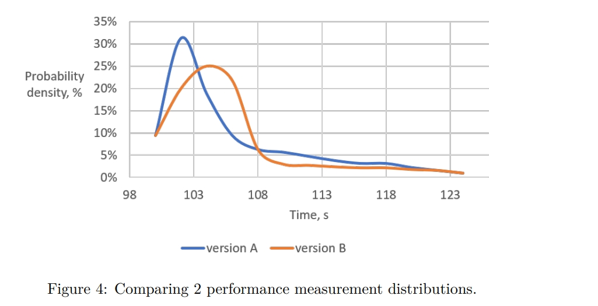

这是因为B的某些测量结果比A更快。即使在B的所有测量结果都比A的每个测量结果都慢的情况下，概率P也不等于100%。这是因为我们始终可以生成一个额外的B样本，它可能比一些A样本更快。

使用分布图的一个有趣优势是它允许您发现基准测试的不良行为[^31]。如果分布是双峰的，那么基准很可能会出现两种不同类型的行为。造成双峰分布测量结果的常见原因是代码同时具有快速路径和慢速路径，例如访问缓存（缓存命中 vs. 缓存未命中）和获取锁（争用锁 vs. 无争用锁）。要“修复”这个问题，应该将不同的功能模式进行隔离并分别进行基准测试。

数据科学家通常通过绘制分布图来展示测量结果，并避免计算加速比。这样可以消除偏见的结论，并允许读者自行解释数据。绘制分布图的一种常见方式是使用箱线图（见图5），它允许在同一张图表上比较多个分布。

虽然可视化性能分布可以帮助您发现某些异常情况，但开发人员不应将其用于计算加速比。通常情况下，通过查看性能测量分布很难估计加速比。另外，正如前面所讨论的，这对于自动化基准测试系统也不适用。通常，我们希望获得一个标量值，表示程序的两个版本之间性能分布的加速比，例如，“版本A相对于版本B的速度快X%”。

使用假设检验方法可以确定两个分布之间的统计关系。如果根据阈值概率（显著性水平），数据集之间的关系能够拒绝零假设[^31]，那么比较就被认为是具有统计显著性的。如果分布[^32]是高斯分布（正态分布[^33]），那么使用参数假设检验（例如学生T检验[^34]）来比较分布就足够了。如果要比较的分布不是高斯分布（例如严重倾斜或多峰分布）

30 另一种检查的方法是运行正态性检验：[正态性检验](https://en.wikipedia.org/wiki/Normality_test)。
31 零假设 - [零假设](https://en.wikipedia.org/wiki/Null_hypothesis)。
32 值得一提的是，在性能数据中很少见到高斯分布。因此，在使用统计教科书上假设高斯分布的公式时要谨慎。
33 正态分布 - [正态分布](https://en.wikipedia.org/wiki/Normal_distribution)。
34 学生t检验 - [学生t检验](https://en.wikipedia.org/wiki/Student’s_t-test)。

