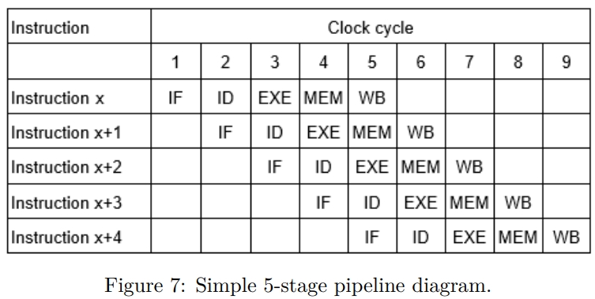

图 7 显示了一个理想的 5 级流水线 CPU 的流水线视图。

周期 1 中，指令 x 进入流水线的 IF 阶段。在下一个周期中，随着指令 x 移动到 ID 阶段，
程序中的下一条指令进入 IF 阶段，依此类推。一旦流水线满了，如上文的第 5 个周期，
CPU 的所有流水线阶段都在繁忙地处理不同的指令。如果没有流水线，指令 x+1 就不能
在指令 1 完成其工作之前开始执行。

大多数现代 CPU 都采用了深度流水线，也被称为超级流水线。流水线 CPU 的吞吐量被定义
为每单位时间完成并退出流水线的指令数量。对于任何给定指令的延迟是流水线的所有阶段
总时间。由于流水线的所有阶段都相互关联，每个阶段必须准备好以步调一致地移动到指令。
将指令从一个阶段移动到另一个阶段所需的时间定义了 CPU 的基本机器周期或时钟。给定
流水线的时钟的选择由流水线的最慢阶段定义。CPU 硬件设计人员努力平衡每个阶段的工作
量，因为这直接定义了 CPU 的操作频率。增加频率可提高性能，通常涉及平衡和重新流水线化，
以消除由最慢的流水线阶段引起的瓶颈。

在理想的流水线中，完全平衡且不会发生任何停顿的情况下，流水线机器中的每条指令的时间由以下公式给出：

\[ \text{流水线机器上每条指令的时间} = \frac{\text{非流水线机器上每条指令的时间}}{\text{流水线阶段数}} \]

在实际实现中，流水线引入了限制理想模型的几个约束。流水线危害阻止理想的流水线行为，
导致停顿。危害的三类是结构危害、数据危害和控制危害。幸运的是，对于程序员来说，在现代
CPU 中，所有类别的危害都由硬件处理。

- 结构危害由资源冲突引起。在很大程度上，可以通过复制硬件资源来消除这些冲突，
比如使用多端口寄存器或存储器。然而，消除所有这些危害可能在硅面积和功耗方面
变得相当昂贵。

- 数据危害由程序中的数据依赖引起，分为三种类型：
  - 读后写 (RAW) 危害需要依赖读取在写入后执行。当指令 x+1 在指令 x 之前读取源
    时发生，导致读取了错误的值。

